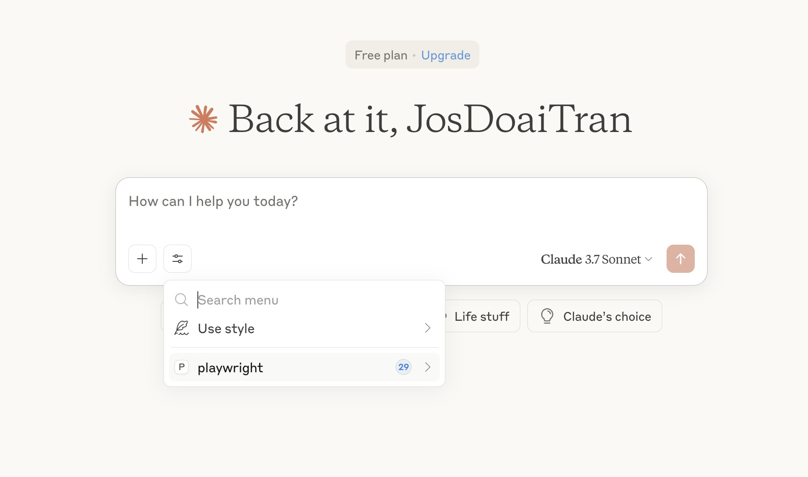

# mcp-web-automation-playwright-vscode-claude
- Let start with a mcp for covering web-automation with playwright in Vscode - Copilot and Claude
- It is based on: MCP Execution Playwright

## MCP - ExecuteAutomation
- https://github.com/executeautomation/mcp-playwright
- A Model Context Protocol server that provides browser automation capabilities using Playwright. This server enables LLMs to interact with web pages, take screenshots, generate test code, web scraps the page and execute JavaScript in a real browser environment.

## VSCode Editor and AI Copilot
- VSCode and Copilot: https://code.visualstudio.com/
- Claude AI and MCP
The Model Context Protocol (MCP) is an open protocol that standardizes how applications provide context and tools to LLMs. Think of MCP as a plugin system for Cursor - it allows you to extend the Agent’s capabilities by connecting it to various data sources and tools through standardized interfaces.

https://docs.anthropic.com/en/docs/agents-and-tools/mcp

# Setup the local environment
## Install MCP Playwright from ExecutionAutomation

### Install via npm (Recommended)
```terminal
npm install -g @executeautomation/playwright-mcp-server
```

In cases, you get the troubles in install some dependencies in node. You can run these command:
```
sudo chown -R $(whoami) ~/.npm
sudo chown -R $(whoami) /usr/local/lib/node_modules/npm/node_modules
sudo chown -R $(whoami) /usr/local/lib/node_modules
sudo chown -R $(whoami) /Users/doaitran/Library/Caches
```

In case, you installed playwright-mcp-server. We should unstall and install again like:
```terminal
❯ npm install -g @executeautomation/playwright-mcp-server
npm error code ENOTEMPTY
npm error syscall rename
npm error path /usr/local/lib/node_modules/@executeautomation/playwright-mcp-server
npm error dest /usr/local/lib/node_modules/@executeautomation/.playwright-mcp-server-PjuoISFK
npm error errno -66
npm error ENOTEMPTY: directory not empty, rename '/usr/local/lib/node_modules/@executeautomation/playwright-mcp-server' -> '/usr/local/lib/node_modules/@executeautomation/.playwright-mcp-server-PjuoISFK'
npm error A complete log of this run can be found in: /Users/doaitran/.npm/_logs/2025-05-04T08_39_52_367Z-debug-0.log
❯ 
❯ 
❯ 
❯ rm -rfv /usr/local/lib/node_modules/@executeautomation/playwright-mcp-server
/usr/local/lib/node_modules/@executeautomation/playwright-mcp-server/node_modules/fsevents/build/config.gypi
/usr/local/lib/node_modules/@executeautomation/playwright-mcp-server/node_modules/fsevents/build
/usr/local/lib/node_modules/@executeautomation/playwright-mcp-server/node_modules/fsevents
/usr/local/lib/node_modules/@executeautomation/playwright-mcp-server/node_modules
/usr/local/lib/node_modules/@executeautomation/playwright-mcp-server
❯ npm install -g @executeautomation/playwright-mcp-server

added 85 packages in 2m

17 packages are looking for funding
  run `npm fund` for details
```

### Using mcp-get:
Run this command:
```
npx @michaellatman/mcp-get@latest install @executeautomation/playwright-mcp-server
```

### Using Smithery
To install Playwright MCP for Claude Desktop automatically via [smithery](https://smithery.ai/server/@executeautomation/playwright-mcp-server):

## Configure Claude Desktop to work with MCP Server

- Settings > Developer > Configure `claude_desktop_config` file this value
```
{
  "mcpServers": {
    "playwright": {
      "command": "npx",
      "args": ["-y", "@executeautomation/playwright-mcp-server"]
    }
  }
}
```
It should be:


Then, we have to reload Claude Desktop app. We will have Playwright as MCP as bellow


# Do some testings via chat prompting

- Example 1
```
- 
```
- Example 2
```

```