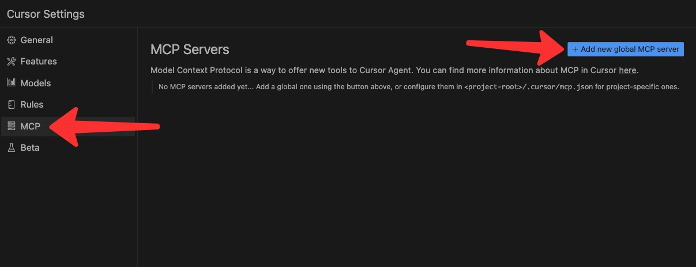
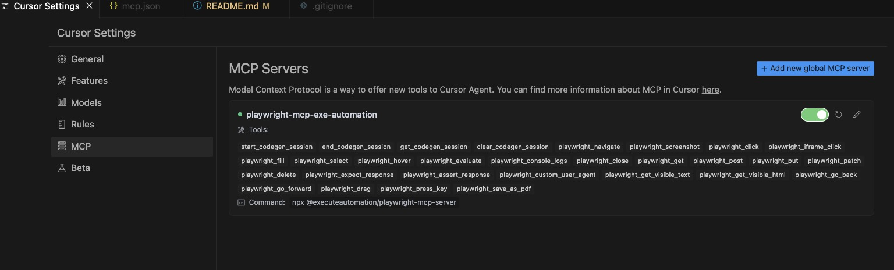

# mcp-web-automation-playwright-cursor
- Let start with a mcp for covering web-automation with playwright in cursor.
- It is based on: MCP Execution Playwright, Cursor

## MCP - ExecuteAutomation
- https://github.com/executeautomation/mcp-playwright
- A Model Context Protocol server that provides browser automation capabilities using Playwright. This server enables LLMs to interact with web pages, take screenshots, generate test code, web scraps the page and execute JavaScript in a real browser environment.

## Cursor AI Editor.
- Modern Editor tool - Core VSCode: https://www.cursor.com/
- MCP feature in Cursor: https://docs.cursor.com/context/model-context-protocol

The Model Context Protocol (MCP) is an open protocol that standardizes how applications provide context and tools to LLMs. Think of MCP as a plugin system for Cursor - it allows you to extend the Agent’s capabilities by connecting it to various data sources and tools through standardized interfaces.

# Setup the local environment
## Install MCP Playwright from ExecutionAutomation:
```terminal
npm install -g @executeautomation/playwright-mcp-server
```

In cases, you get the troubles in install some dependencies in node. You can run these command:
```
sudo chown -R $(whoami) ~/.npm
sudo chown -R $(whoami) /usr/local/lib/node_modules/npm/node_modules
sudo chown -R $(whoami) /usr/local/lib/node_modules
sudo chown -R $(whoami) /Users/doaitran/Library/Caches
```

In case, you installed playwright-mcp-server. We should unstall and install again like:
```terminal
❯ npm install -g @executeautomation/playwright-mcp-server
npm error code ENOTEMPTY
npm error syscall rename
npm error path /usr/local/lib/node_modules/@executeautomation/playwright-mcp-server
npm error dest /usr/local/lib/node_modules/@executeautomation/.playwright-mcp-server-PjuoISFK
npm error errno -66
npm error ENOTEMPTY: directory not empty, rename '/usr/local/lib/node_modules/@executeautomation/playwright-mcp-server' -> '/usr/local/lib/node_modules/@executeautomation/.playwright-mcp-server-PjuoISFK'
npm error A complete log of this run can be found in: /Users/doaitran/.npm/_logs/2025-05-04T08_39_52_367Z-debug-0.log
❯ 
❯ 
❯ 
❯ rm -rfv /usr/local/lib/node_modules/@executeautomation/playwright-mcp-server
/usr/local/lib/node_modules/@executeautomation/playwright-mcp-server/node_modules/fsevents/build/config.gypi
/usr/local/lib/node_modules/@executeautomation/playwright-mcp-server/node_modules/fsevents/build
/usr/local/lib/node_modules/@executeautomation/playwright-mcp-server/node_modules/fsevents
/usr/local/lib/node_modules/@executeautomation/playwright-mcp-server/node_modules
/usr/local/lib/node_modules/@executeautomation/playwright-mcp-server
❯ npm install -g @executeautomation/playwright-mcp-server

added 85 packages in 2m

17 packages are looking for funding
  run `npm fund` for details
```

## Install Cursor and Setup MCP in Cursor
- Go Settings in Cursor. Settings > Cursor Settings
- MCP tab

- Edit mcp.json from
```json
{
  "mcpServers": {}
}
```
to 
```json
{
  "mcpServers": {
    "playwright-mcp-exe-automation":{
        "command": "npx",
        "args": [
            "@executeautomation/playwright-mcp-server"
        ]
    }
  }
}
```
If we configured successfully, We can see our MCP in Cursor like this


# Let us check our MCP running or not?
We can ask LLM AI in Cursor with this prompt:
```
Is my playwright-mcp-exe-automation MCP server running ?
```
Cursor AI will asked us to run this command:
```
ps aux | grep playwright-mcp-server | grep -v grep | cat
```
And here is response from Cursor AI
```cmd
Yes, your playwright-mcp-exe-automation MCP server is currently running. The process list shows both the node /usr/local/bin/playwright-mcp-server and the npm exec @executeautomation/playwright-mcp-server processes, which means the server is active and running in the background.
If you need to check its status further or interact with it, let me know!
```

## Setup - Python and dependencies to run the example executed code

- Install Python
- Configure Virtual Python in this project.
```
# Set up virtual environment
python3 -m venv venv
# On MacOSX / Linux
source venv/bin/activate  
# On Windows: venv\Scripts\activate
```